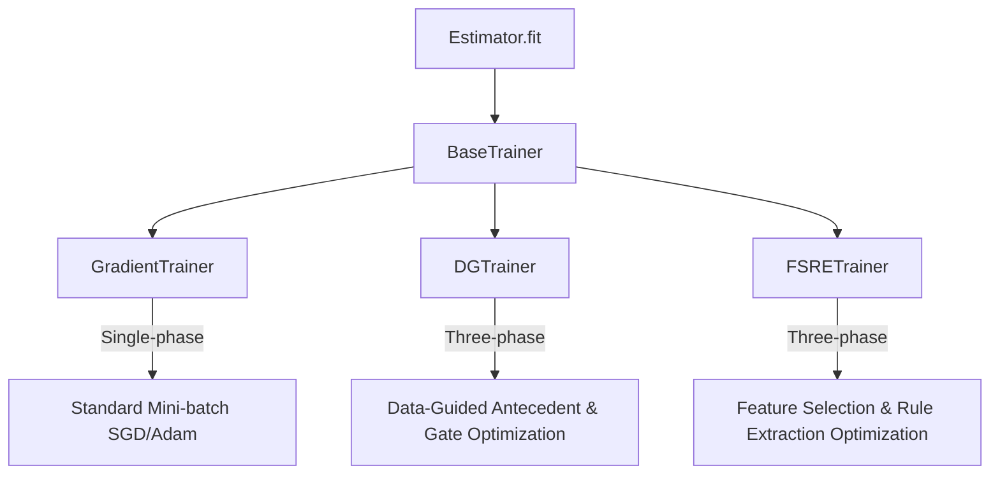

# Optimization and Training Strategies

In **highFIS**, the model definition is decoupled from the optimization loops. This separation of concerns allows the model layers to focus purely on PyTorch forward execution, while training protocols handle batching, learning rate schedules, parameter locking/freezing, and specialized multi-phase algorithms.

All training strategies inherit from the abstract class `BaseTrainer` and decouple the optimization loop from the `scikit-learn` estimator interface.

---

## The Trainer Architecture

Each estimator class in `highFIS` delegates its `.fit()` call to a dedicated trainer. The trainer handles the standard training loop (epoch-wise validation, early stopping, logging) as well as advanced phase transitions.



---

## 1. GradientTrainer

The `GradientTrainer` implements standard single-phase mini-batch gradient descent. It is used by baseline models like `TSK`, `HTSK`, `LogTSK`, `DombiTSK`, `ADMTSK`, `AYATSK`, `ADATSK`, and `ADPTSK`.

> **Note:** All model parameters (antecedent means/widths, rule weights, and consequent weights) are optimized simultaneously using standard PyTorch optimizers (e.g., Adam) and learning rate schedulers.

### Configuration Parameters
You can configure the trainer directly through the estimator's constructor arguments:
*   `epochs`: Total training epochs (default: `100`).
*   `learning_rate`: Step size for weight updates (default: `0.01`).
*   `batch_size`: Size of mini-batches. If `None`, full-batch training is performed.
*   `weight_decay`: L2 regularization strength.

### Example: Training with GradientTrainer and Inspecting History

This example shows how to configure a model using standard gradient optimization, and then inspect the resulting training logs.

```python
from sklearn.datasets import make_classification
from sklearn.preprocessing import MinMaxScaler
from highfis import HTSKClassifier

# Generate mock classification data
X, y = make_classification(n_samples=500, n_features=10, random_state=42)
X_scaled = MinMaxScaler().fit_transform(X)

# Instantiate the HTSK Classifier with custom optimization settings
clf = HTSKClassifier(
    n_mfs=3,
    mf_init="kmeans",
    epochs=120,
    learning_rate=0.005,
    batch_size=64,
    weight_decay=1e-5,
    verbose=True,
    random_state=42
)

# Fit the model (delegates training to GradientTrainer)
clf.fit(X_scaled, y)

# The training history is captured in clf.history_
print("Final training loss:", clf.history_["train"][-1])
print("Epochs executed:", clf.history_["stopped_epoch"])
```

---

## 2. DGTrainer (Double-Gated Training)

Specialized for `DGTSK` and `DGALETSK` model families, the `DGTrainer` implements the three-phase **Data-Guided (DG)** training protocol. This protocol is critical for establishing sparse high-dimensional structures by systematically pruning feature and rule gates.

```
                  ┌─────────────────────────────────────────┐
                  │ Phase 1: Antecedent & Consequent Warmup  │
                  │ (Gate parameters are frozen)             │
                  └────────────────────┬────────────────────┘
                                       │
                                       ▼
                  ┌─────────────────────────────────────────┐
                  │ Phase 2: Gate Optimization              │
                  │ (Antecedent parameters are frozen)      │
                  └────────────────────┬────────────────────┘
                                       │
                                       ▼
                  ┌─────────────────────────────────────────┐
                  │ Phase 3: Joint Fine-Tuning              │
                  │ (All parameters unfrozen and optimized) │
                  └─────────────────────────────────────────┘
```

### The Three Phases
1.  **Warm-up Phase (`fit_warmup_phase`)**: Antecedent membership functions and consequents are optimized to match the target signal. The structural gates are frozen to prevent premature pruning.
2.  **Gate Selection Phase (`fit_dg_phase`)**: The gate parameters ($\lambda, \theta$) are unfrozen and optimized under an L1 or entropy penalty to induce sparsity, while antecedents remain frozen.
3.  **Joint Fine-Tuning (`fit_joint_phase`)**: All parameters are unfrozen and optimized jointly to polish the final sparse model.

### Key DGTrainer Settings
*   `dg_epochs` / `finetune_epochs`: Duration of the gate optimization and fine-tuning phases.
*   `dg_learning_rate` / `finetune_learning_rate`: Separate step sizes for phase-specific updates.
*   `zeta_lambda` / `zeta_theta`: Pruning threshold grid search options (defaults: `[0.0, 0.25, 0.5, 0.75, 1.0]`).
*   `use_lse`: Re-estimates consequent weights using Least Squares Estimation (LSE) during search.
*   `structural_pruning`: Hard-prunes the PyTorch neural network parameters of dropped rules/features to speed up forward/backward passes.

### Example: Double-Gated Sparse Feature Selection

```python
from sklearn.datasets import make_classification
from sklearn.model_selection import train_test_split
from highfis import DGTSKClassifier
from highfis.optim import DGTrainer

# Create high-dimensional data (e.g. 50 features, only 10 informative)
X, y = make_classification(n_samples=1000, n_features=50, n_informative=10, random_state=42)
X_train, X_val, y_train, y_val = train_test_split(X, y, test_size=0.2, random_state=42)

# Define custom three-phase trainer settings
custom_trainer = DGTrainer(
    dg_epochs=30,
    dg_learning_rate=0.01,
    zeta_lambda=[0.1, 0.3, 0.5, 0.7],  # Custom feature gate threshold grid
    zeta_theta=[0.2, 0.4, 0.6],        # Custom rule gate threshold grid
    use_lse=True,
    finetune_epochs=150,
    finetune_learning_rate=0.005,
    verbose=True
)

# Instantiate the estimator and assign our trainer
clf = DGTSKClassifier(
    n_mfs=3,
    trainer=custom_trainer,
    random_state=42
)

# Train the model (automatically cycles through DG optimization, threshold search, and fine-tuning)
clf.fit(X_train, y_train, x_val=X_val, y_val=y_val)

# Introspect the pruned structural statistics
print("Retained Feature Indices:", clf.model_.surviving_feature_indices)
print("Retained Rules:", len(clf.model_.surviving_rule_indices))
```

---

## 3. FSRETrainer (Feature Selection & Rule Extraction)

The `FSRETrainer` implements a custom three-phase optimization protocol tailored for `FSRE-ADATSK` estimators. It targets the simultaneous optimization of softmin aggregation parameters and the structural feature/rule gates.

*   **Phase 1 (Feature Selection)**: Focuses on determining the initial membership function layouts and optimizing feature gates $\lambda_d$.
*   **Phase 2 (Rule Extraction)**: Locks selected features, expands the system to the full Rule Base ($En-FRB$), and optimizes rule gates $\theta_r$ under pruning penalties.
*   **Phase 3 (Refinement/Fine-tuning)**: Locks the pruned architecture and updates the remaining membership parameters and consequent weights to restore accuracy.

### Key FSRETrainer Settings
*   `fs_epochs` / `re_epochs` / `finetune_epochs`: Durations for the three phases.
*   `zeta_lambda`: Feature pruning threshold coefficient (default: `0.5`). Larger values retain more features. Recommend `0.4` for high-dimensional datasets.
*   `zeta_theta`: Rule pruning threshold coefficient (default: `0.3`). Recommend `0.5` for high-dimensional datasets.
*   `structural_pruning`: Hard-prunes the structural tensors in the model to optimize execution speed.

### Example: Feature Selection and Rule Extraction in Softmin TSK

```python
from sklearn.datasets import make_classification
from highfis import FSREADATSKClassifier
from highfis.optim import FSRETrainer

# Load classification data
X, y = make_classification(n_samples=800, n_features=20, random_state=42)

# Configure the three-phase FSRE trainer
fsre_trainer = FSRETrainer(
    fs_epochs=20,
    fs_learning_rate=0.01,
    re_epochs=20,
    re_learning_rate=0.01,
    finetune_epochs=100,
    finetune_learning_rate=0.005,
    zeta_lambda=0.4,   # Pruning threshold coefficient for features
    zeta_theta=0.5,    # Pruning threshold coefficient for rules
    verbose=True
)

# Instantiate the model with our customized FSRE training loop
clf = FSREADATSKClassifier(
    n_mfs=3,
    trainer=fsre_trainer,
    random_state=42
)

# Fit the classifier
clf.fit(X, y)
```

---

## Configuring Custom Optimizers

While estimators provide a scikit-learn API, you can customize the underlying optimizer class (e.g., using `SGD`, `RMSprop`, or `AdamW`) and learning rate scheduler by overriding the estimator's `optimizer_class`.

### Example: Custom PyTorch Optimizers and Parameters

You can pass the class reference of any standard PyTorch optimizer (from `torch.optim`) to the `optimizer_class` parameter.

```python
from torch.optim import AdamW
from highfis import HTSKClassifier

# Instantiate HTSK with a custom optimizer configuration
clf = HTSKClassifier(
    epochs=150,
    learning_rate=1e-3,
    optimizer_class=AdamW,  # Pass the PyTorch optimizer class
    random_state=42
)

# Fit the model
clf.fit(X_train, y_train)
```

---

## 4. Training History and Metric Logging

Each trainer populates the estimator's `history_` attribute after fitting the model. Internally, the optimization loop computes all metrics on the training and validation sets using **pure PyTorch** on the active device (e.g., CPU or CUDA GPU) to avoid expensive, synchronous data transfers to the host memory during training. Only the final scalar metrics are converted to Python floats when written to the history dictionary at the end of each epoch.

### History Structure and Keys

The `history_` dictionary contains the following keys depending on the trainer and parameters:

*   **`"train"`**: The loss value computed on the training set for each epoch.
*   **`"ur"`**: The Uniform Regularization loss value computed on the training set for each epoch.
*   **`"val"`**: The validation loss computed on the validation set for each epoch (only present if `validation_data` or `x_val`/`y_val` is provided).
*   **`"train_<metric>"` / `"val_<metric>"`**: The epoch-wise performance of custom or default metrics.
*   **`"stopped_epoch"`**: The final epoch index executed (especially useful when early stopping is triggered).

### Default and Custom Metrics

If no metrics are explicitly specified, the trainers automatically configure task-appropriate defaults:
*   **Classification**: Defaults to `"accuracy"` (creating `"train_accuracy"` and `"val_accuracy"` keys).
*   **Regression**: Defaults to `"mse"` (creating `"train_mse"` and `"val_mse"` keys).

To track additional metrics, pass them as a list of strings to the `.fit()` method:

```python
# Train the model while tracking accuracy and macro F1 score
clf.fit(
    X_train, y_train,
    x_val=X_val, y_val=y_val,
    metrics=["accuracy", "f1_macro"]
)

# Inspect the captured metrics
print("Training Macro F1 per epoch:", clf.history_["train_f1_macro"])
print("Validation Accuracy per epoch:", clf.history_["val_accuracy"])
```

---

## 5. Uniform Regularization (UR)

In Takagi-Sugeno-Kang (TSK) fuzzy neural networks, mini-batch gradient descent can sometimes lead to rule starvation or rule dominance, where a subset of rules dominates the output while others are never activated. This reduces the generalization performance of the model.

**Uniform Regularization (UR)** resolves this by penalizing the deviation of the average rule activations from a target uniform distribution over each batch.

### Mathematical Formulation

The Uniform Regularization loss $L_{\text{UR}}$ added to the primary task loss is formulated as:

$$
L_{\text{UR}} = \sum_{r=1}^{R} \left( \bar{a}_r - t \right)^2
$$

Where:
*   $R$ is the number of fuzzy rules.
*   $\bar{a}_r$ is the average normalized activation (firing strength) of rule $r$ across all samples in the current mini-batch:
    $$
    \bar{a}_r = \frac{1}{B} \sum_{b=1}^{B} \bar{w}_r(x_b)
    $$
*   $t$ is the target uniform activation level. Typically, this is set to $1/R$, meaning every rule is expected to contribute equally on average.

### Configuration Parameters

Uniform Regularization is configured using two hyperparameters on the estimator:
*   **`ur_weight`**: The regularization strength (default: `0.0`). If set to `0.0`, no UR penalty is added to the loss function during backpropagation. However, the value of the metric is still computed and logged to `history_["ur"]` for monitoring.
*   **`ur_target`**: The target activation level $t$ (default: `None`, which defaults to $1/R$).

### Interpretation of UR Values

*   **`ur` $\approx 0.0$**: The rule activations are perfectly and uniformly distributed across the batch. Every rule is contributing.
*   **`ur` $> 0.5$**: The rule activations are highly unbalanced. This suggests that either:
    1.  Only a few rules are doing all the work (dominating), while the others are starved (inactive).
    2.  Many rules are activating in a highly correlated way, reducing the diversity of the rule base.

### Scientific Reference

For more details on the rationale and effectiveness of Uniform Regularization, refer to:

> Y. Cui, D. Wu and J. Huang, "Optimize TSK Fuzzy Systems for Classification Problems: Minibatch Gradient Descent With Uniform Regularization and Batch Normalization," in IEEE Transactions on Fuzzy Systems, vol. 28, no. 12, pp. 3065-3075, Dec. 2020, doi: 10.1109/TFUZZ.2020.2967282.
