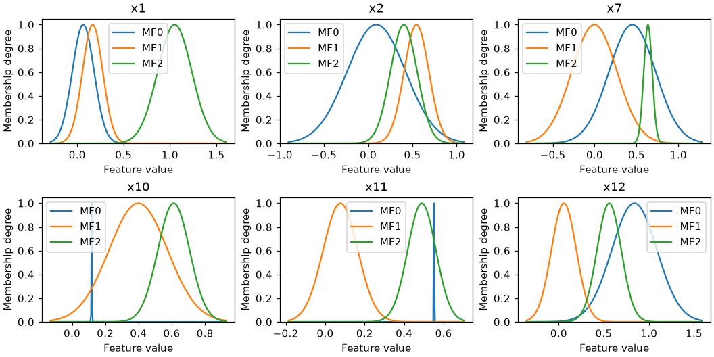
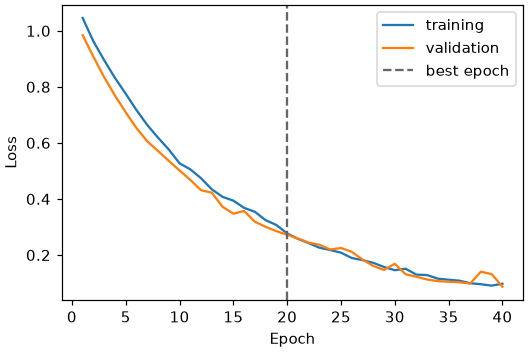
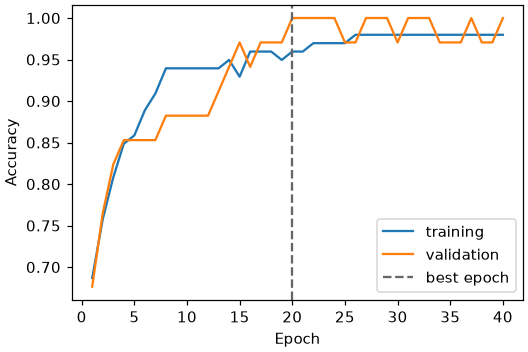
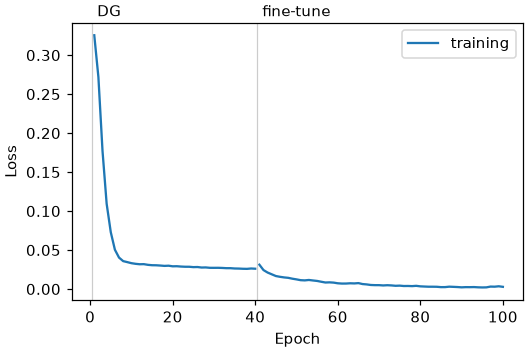
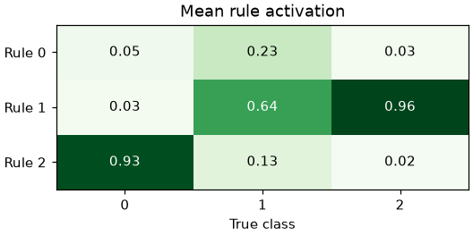
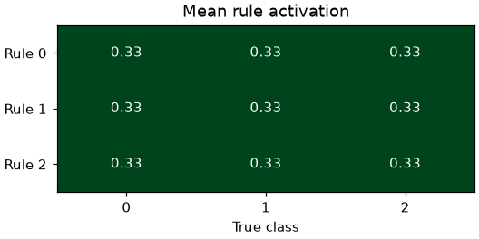
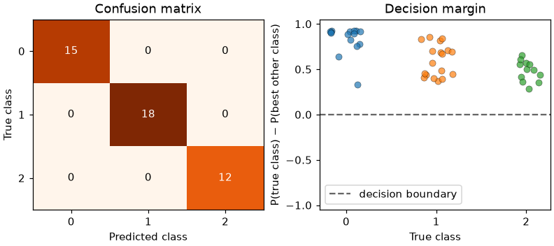
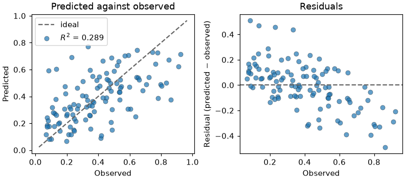

# Diagnostic Plots

Every fitted estimator has a `plot` method. It draws one of four diagnostic plots, chosen
with `kind`:

| `kind` | Shows | Needs data |
|---|---|---|
| `"memberships"` (default) | The learned fuzzy sets, one panel per feature | no |
| `"history"` | Loss or a metric per epoch | no |
| `"rule_activation"` | Mean firing strength of each rule, by class when labels are given | `X`, optionally `y` |
| `"diagnostics"` | Confusion matrix and decision margin, or fit and residuals | `X` and `y` |

Each kind is also a method of its own (`plot_memberships`, `plot_history`,
`plot_rule_activation`, `plot_diagnostics`), which is easier to discover with
autocompletion.

Plotting needs matplotlib, which is an optional dependency:

```bash
pip install highfis[plot]
```

The plots follow the usual matplotlib conventions: they accept `ax` to draw on existing
axes, they return the `Axes` (single panel) or the `Figure` (several panels), and they
never call `plt.show()` or change global settings. Save a plot with
`fig.savefig("plot.png")`, or `ax.figure.savefig("plot.png")` for a single panel.

The examples below share one fitted model:

```python
from sklearn.datasets import load_wine
from sklearn.model_selection import train_test_split
from sklearn.preprocessing import MinMaxScaler

from highfis import HTSKClassifier

X, y = load_wine(return_X_y=True)
X_train, X_test, y_train, y_test = train_test_split(X, y, test_size=0.25, random_state=0, stratify=y)
X_fit, X_val, y_fit, y_val = train_test_split(X_train, y_train, test_size=0.25, random_state=0, stratify=y_train)

scaler = MinMaxScaler().fit(X_fit)
X_fit, X_val, X_test = scaler.transform(X_fit), scaler.transform(X_val), scaler.transform(X_test)

clf = HTSKClassifier(n_mfs=3, epochs=100, random_state=0)
clf.fit(X_fit, y_fit, x_val=X_val, y_val=y_val, metrics=["accuracy"])

fig = clf.plot()                                              # memberships
ax = clf.plot(kind="history")
ax = clf.plot(kind="rule_activation", X=X_test, y=y_test)
fig = clf.plot(kind="diagnostics", X=X_test, y=y_test)
```

## Membership functions

```python
fig = clf.plot(kind="memberships")
```



One panel per feature, one curve per fuzzy set, drawn from the trained model itself.

- With more than `max_features` features (6 by default), the most important ones
  according to `feature_importance()` are shown. Pass `features=[...]` to choose them, by
  name or by column index.
- Panels are titled with the feature names when the model was fitted on a pandas
  `DataFrame`, and with `x1`, `x2`, ... otherwise.
- The horizontal range is taken from the fuzzy sets. Pass `X=` to span the data instead.
- Families that prune features (DG-TSK, DG-ALETSK, FSRE-ADATSK) show the features that
  survived.

What to look for: sets that overlap almost completely carry the same information; a set
much narrower than the others covers very few samples.

## Training history

```python
ax = clf.plot(kind="history")
ax = clf.plot(kind="history", metric="accuracy")
```



The validation curve appears when a validation set was passed to `fit`, and the dashed
line marks the best epoch, whose weights the model keeps. For classifiers the best epoch
is the one with the highest validation accuracy, not the lowest validation loss, so
training can stop while the loss is still falling, as it does here. For regressors it is
the epoch with the lowest validation loss.

`metric` plots any metric requested in `fit(..., metrics=[...])`:



Families that train in phases show them one after the other:



What to look for: a training curve that keeps oscillating at the last epoch means the
model returned depends on where training happened to stop. Lower the learning rate or
use a scheduler.

## Rule activation

```python
ax = clf.plot(kind="rule_activation", X=X_test, y=y_test)
```



Each cell is the mean normalized firing strength of a rule over the samples of a class.
Without `y`, or for a regressor, the plot is a bar per rule over all samples.

What to look for: in a model that uses its rules, each class is carried by one or a few
rules, as above. A plot where every cell has the same value means the rules do not
discriminate. That happens to the classical TSK when the product of many membership
degrees underflows: every rule gets the same weight and the model reduces to a single
linear model. Here is the same data fitted with `TSKClassifier`:



Its accuracy is still high on this dataset, so the score alone does not reveal the
problem. The high-dimensional families exist to avoid it.

## Prediction diagnostics

```python
fig = clf.plot(kind="diagnostics", X=X_test, y=y_test)
```



For a classifier, the left panel is the confusion matrix. The right panel shows the
decision margin of every sample, grouped by its true class: the probability given to the
true class minus the highest probability given to another class. A sample below zero is
misclassified, and samples just above zero are the ones the model is least sure about.

For a regressor, the panels are the predicted against the observed values and the
residuals:

```python
from sklearn.datasets import load_diabetes
from sklearn.model_selection import train_test_split
from sklearn.preprocessing import MinMaxScaler

from highfis import HTSKRegressor

X, y = load_diabetes(return_X_y=True)
X_train, X_test, y_train, y_test = train_test_split(X, y, test_size=0.25, random_state=0)
x_scaler, y_scaler = MinMaxScaler().fit(X_train), MinMaxScaler().fit(y_train.reshape(-1, 1))

reg = HTSKRegressor(n_mfs=3, epochs=150, random_state=0)
reg.fit(x_scaler.transform(X_train), y_scaler.transform(y_train.reshape(-1, 1)).ravel())

fig = reg.plot(
    kind="diagnostics",
    X=x_scaler.transform(X_test),
    y=y_scaler.transform(y_test.reshape(-1, 1)).ravel(),
)
```



What to look for: residuals that trend with the observed value, as here, mean the model
shrinks its predictions towards the mean.

## Drawing on your own axes

```python
import matplotlib.pyplot as plt

fig, (left, right) = plt.subplots(1, 2, figsize=(9, 3.5))
clf.plot(kind="history", ax=left)
clf.plot(kind="rule_activation", X=X_test, y=y_test, ax=right)
```

Single-panel plots take one `Axes`. `"memberships"` takes one per feature shown and
`"diagnostics"` takes two.

The same functions are available in `highfis.plotting` and take the estimator as their
first argument; see the [API reference](../api/plotting.md).
